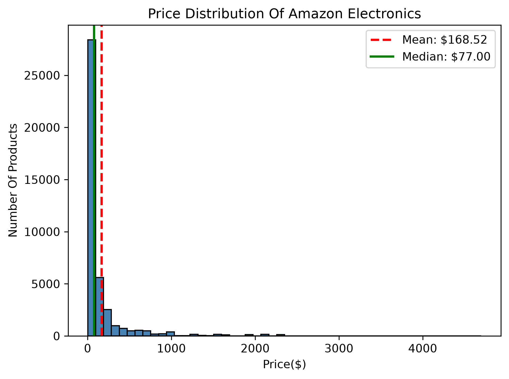
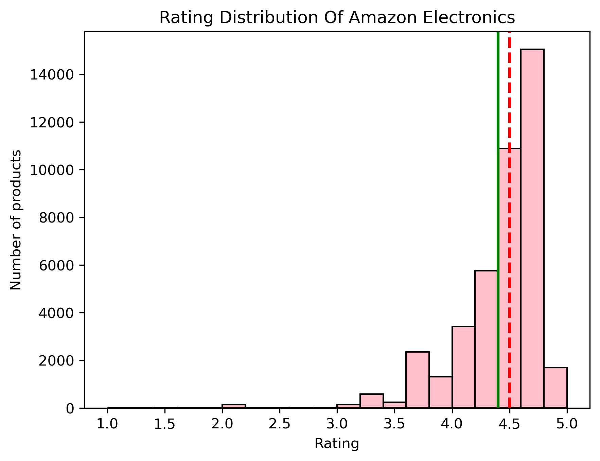
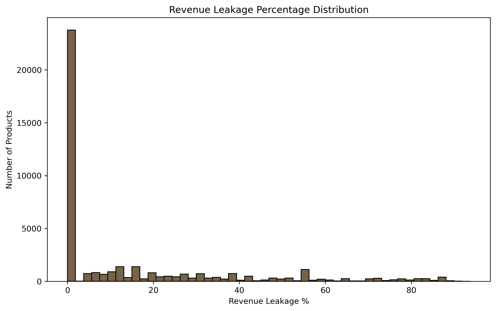
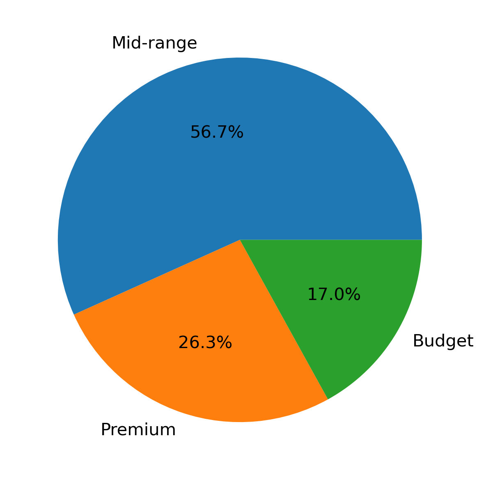
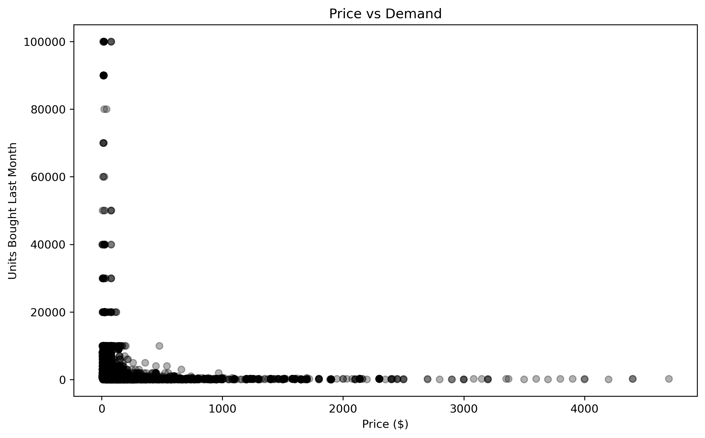
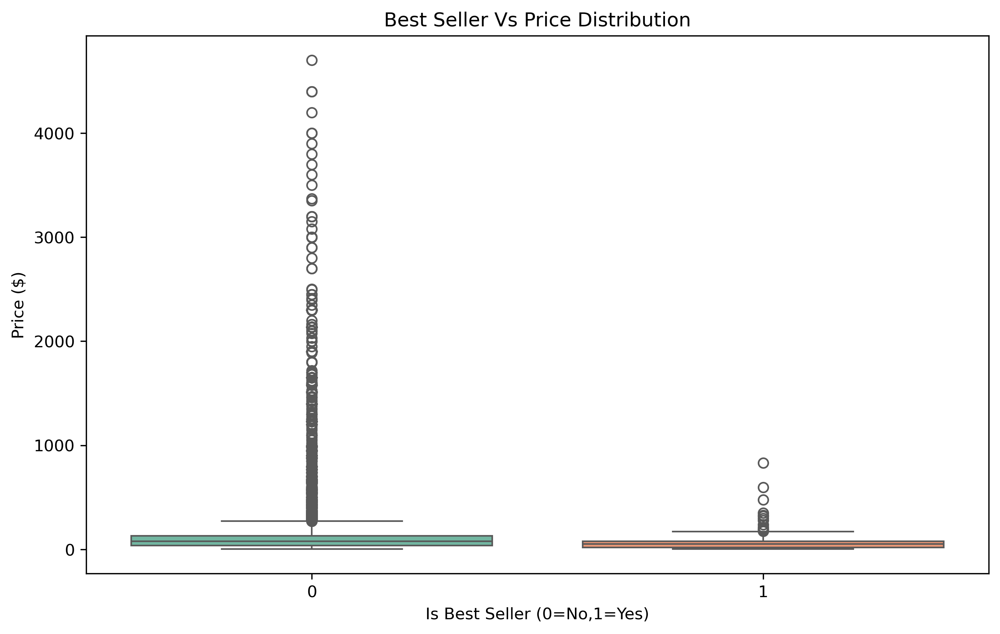
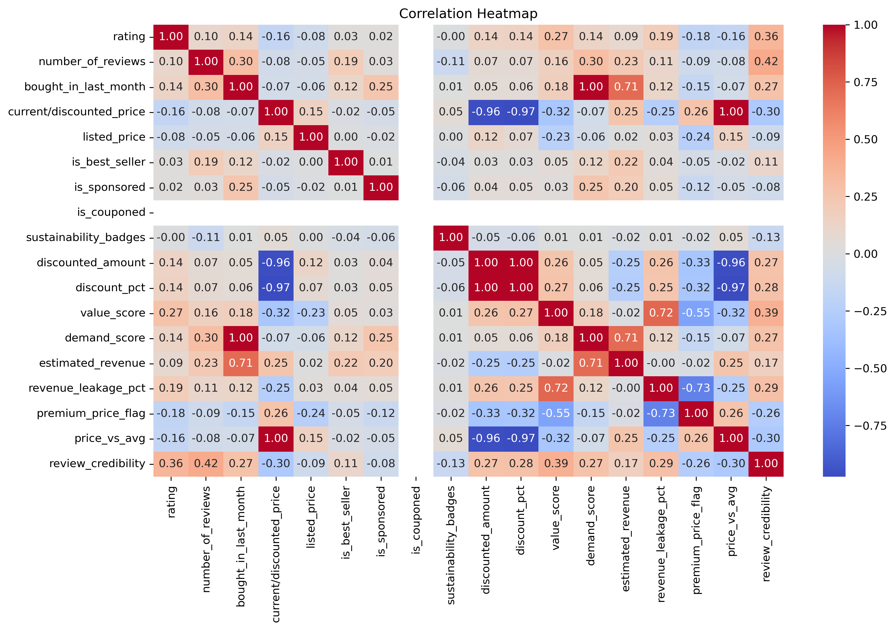

# Ecommerce-Revenue-Intelligence
AI-Powered dynamic pricing intelligence system for ecommerce
# Findings after feature construction
"Revenue Leakage Analysis:
→ 50% of products have zero revenue leakage
→ 25% of products lose more than 21% revenue
→ Maximum leakage of 93.7% detected
   (product selling at nearly zero profit!)
→ Average revenue leakage: 14.28%
→ High std (22.57%) suggests inconsistent
  discounting strategy across catalog"

  "Premium Pricing Analysis:
→ 56.7% products flagged as premium priced
→ CAUTION: listed_price had 72% missing values
  filled with median → may inflate premium flag
→ Reliable premium detection only possible
  with complete listed_price data
→ Recommend collecting actual listed prices
  for accurate premium detection"

 #Business interpretation scale for price_vs_avg extra added feature:
 price_vs_avg < 0.5  → Deep budget
                       (less than half of average!)

price_vs_avg 0.5-0.8 → Budget
                        (below average)

price_vs_avg 0.8-1.2 → Mid market
                        (around average ±20%)

price_vs_avg 1.2-2.0 → Premium
                        (above average)

price_vs_avg > 2.0   → Luxury/Ultra premium
                        (more than 2x average!)

#Why price_vs_avg is more powerful than price_category:
price_category:
Product A ($15) → "Budget"
Product B ($24) → "Budget"
→ Both look same! No differentiation!

price_vs_avg:
Product A ($15) → 0.19 (very budget!)
Product B ($24) → 0.31 (less budget!)
→ Shows HOW budget each product is!
→ More precise for ML model!
Example from dataset:
- USB Cable ($9.99): 0.13 → Deep budget
- Wireless Mic ($89.68): 1.16 → Upper mid
- DJI Mic ($314): 4.07 → Luxury tier  

Added Review Credibility Score feature through logarithmic scaling:
Formula: rating × log(number_of_reviews + 1)

Why log?
→ Prevents large review counts from
  dominating the score unfairly
→ 100K reviews is not 10,000x better
  than 10 reviews in terms of credibility!
→ Logarithmic scaling = fair comparison!

Why +1?
→ Prevents log(0) error
→ Products with 0 reviews get score of 0

Interpretation:
Low score  → either low rating OR few reviews
High score → high rating AND many reviews
             = most trustworthy product!

## 📊 Exploratory Data Analysis

### Chart 1: Price Distribution of Amazon Electronics

**Plot Details:**
- Chart Type: Histogram (bins=50)
- Column: current/discounted_price
- Reference Lines: Mean ($168.52) and Median ($77.00)

**Distribution Type:**
Heavily Right Skewed (Positive Skew)

**Analysis:**
Majority of products concentrated in $0-$200 range 
with 28,000+ products in lowest price bin. Mean ($168.52) 
is significantly higher than Median ($77.00) with a gap 
of $91.52 caused by luxury products ($2,000-$4,500) 
pulling mean artificially rightward. Median better 
represents true center of data confirming correct 
decision to use median strategy for missing value imputation.

**Business Insights:**
- Amazon electronics catalog dominated by budget 
  to mid-range products ($0-$200)
- Three natural price clusters identified:
  Mass market ($0-$200) | Mid-premium ($200-$500) | Luxury ($500+)
- Premium segment ($1,000+) significantly underserved
  representing potential business opportunity
- Mean price ($168.52) is misleading — Median ($77.00) 
  better represents typical Amazon electronics price             

### Chart 2: Rating Distribution of Amazon Electronics

**Plot Details:**
- Chart Type: Histogram (bins=20)
- Column: rating
- Reference Lines: Mean (4.40) and Median (4.50)

**Distribution Type:**
Left Skewed

**Analysis:**
1.90% of the products are rated above 4.0 indicating that high customer satisfaction
2.14000+ reviews are positive(peak at 4.7)

**Business Insights:**
Implication for pricing:
 → Rating alone NOT enough differentiator
 → Need review_credibility score
   to distinguish truly trustworthy products!"

### Chart 3: Revenue Leakage Distribution

**Plot Type:** Histogram (bins=50)
**Column:** revenue_leakage_pct

**Key Observations:**
- 23,000+ products show ZERO revenue leakage
- Remaining products spread across 0-93% leakage
- Some extreme cases losing up to 93% revenue
- Right skewed distribution

**Business Insights:**
- 55%+ products optimally or premium priced
- 45% products show varying revenue leakage
- Extreme leakage cases (80-93%) represent
  immediate repricing opportunities
- Average leakage of 14.28% across catalog
  suggests inconsistent discounting strategy 

### Chart 4: Price Category Distribution

**Plot Type:** Pie Chart
**Column:** price_category

**Price Split:**
- Mid-range → 56.7% (dominant!)
- Premium   → 26.3% (significant!)
- Budget    → 17.0% (minority!)

**Business Insights:**
- Amazon electronics NOT just a budget marketplace!
- Mid-range ($25-$125) is most competitive space
- Premium segment (26.3%) higher than expected
- Budget products (17%) face highest price pressure
- Pricing intelligence most critical in 
  Mid-range segment where competition is highest
- Premium segment represents higher 
  revenue opportunity per product  

### Chart 5: Rating vs Price Analysis

**Plot Type:** Scatter Plot
**Columns:** rating vs current/discounted_price

**Key Observations:**
- Low budget products ($0-$500) are 
  concentrated at high ratings (4.0-5.0)
- Premium products ($2000-$4500) have 
  limited data points suggesting fewer listings
- No clear linear relationship between 
  price and rating

**Business Insights:**
- Higher price does NOT guarantee better rating
- Amazon customers can find HIGH quality 
  at LOW prices
- Expensive products don't always satisfy 
  customers more than affordable ones
- This validates value_score (rating/price) 
  as more meaningful metric than price alone
- Pricing strategy should consider BOTH 
  rating AND price together not independently 

### Chart 6: Price vs Demand Analysis

**Key Observations:**
- Strong inverse relationship between 
  price and demand(negative corelation)
- Low priced products ($0-$200) show 
  highest demand (up to 100,000 units/month!)
- Demand drops significantly above $500
- No perfect linear relationship exists
- Few viral budget products dominate demand

**Business Insights:**
- Price is KEY driver of demand for electronics
- Budget products dominate sales volume
- Premium products sacrifice volume for margin
- Viral products at low prices represent 
  highest revenue opportunity
- Price reduction strategy most effective 
  for demand generation in this catalog  

### Chart 7: Best Seller vs Price Distribution

**Plot Type:** Box Plot (Seaborn)
**Columns:** is_best_seller vs current/discounted_price

**Key Observations:**
- Best Seller products (1) have lower median price
  than Non-Best Sellers (0)
- Non-Best Sellers show extreme outliers up to $4,500
- Best Sellers concentrated in lower price range
  with max outlier around $800
- Best Seller price range is more consistent

**Business Insights:**
- Best Sellers tend to be AFFORDABLE products
- Amazon's Best Seller badge favors 
  competitively priced products
- High priced products rarely achieve 
  Best Seller status
- Pricing competitively increases chances
  of earning Best Seller badge
- Companies should target lower price points
  to maximize Best Seller opportunities  

### Chart 8: Correlation Heatmap

**Plot Type:** Heatmap (Seaborn)
**Columns:** All numerical features

**Key Correlations Found:**
- current_price ↔ discount_pct = -0.97 (strong negative)
- current_price ↔ discounted_amount = -0.96 (strong negative)
- demand_score ↔ bought_in_last_month = 1.00 (perfect!)
- value_score ↔ revenue_leakage_pct = 0.72 (positive)
- estimated_revenue ↔ bought_in_last_month = 0.71 (positive)

**Business Insights:**
- Expensive products receive proportionally 
  less discount (-0.97 correlation)
- High value products show highest revenue 
  leakage (0.72 correlation)
- demand_score perfectly mirrors 
  bought_in_last_month confirming 
  normalization was correct
- Strong multicollinearity detected between
  several engineered features  

